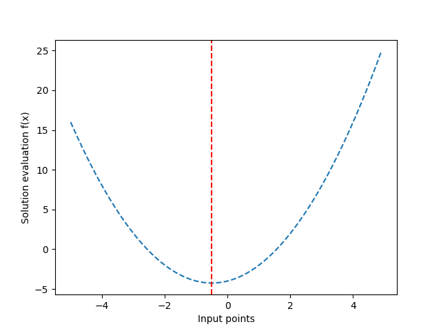
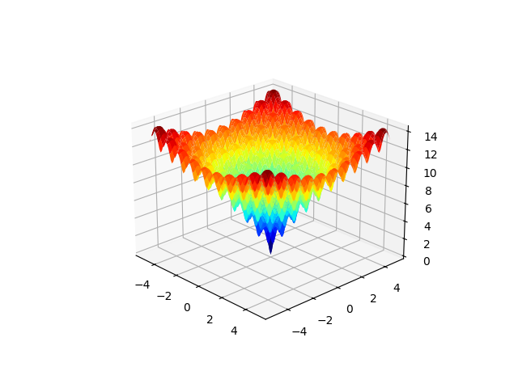

# Python implementations of Hill Climbing search algorithm

### Running the code
- create virtual environment with `pip` or `conda` and activate it,
- install dependencies from the `requirements.txt` file, for example `pip install -r requirements.txt`, 
- run the given script with `python name_of_the_file.py`,
- enjoy the results :smiley:


### I. A little bit of theory  
1. The **hill climbing algorithm** (HCA) involves generating a candidate solution and evaluating it. 
This is the starting point that is then incrementally improved until either no further improvement can be achieved or we run out of time, 
resources, or interest.  
New candidate solutions are generated from the existing candidate solution. 
Typically, this involves making a single change to the candidate solution, 
evaluating it, and accepting the candidate solution as the new “current” solution if it is as good or better than the previous current solution. 
Otherwise, it is discarded.  

2. Local search algorithms in general can get stuck in local optima. 
One approach to address this problem is to restart the search from a new randomly selected starting point. 
The restart procedure can be performed many times and may be triggered after a fixed number of function evaluations or if no further improvement is seen
for a given number of algorithm iterations. This algorithm is called **stochastic hill climbing with random restarts**.

3. The Iterated Local Search (ILS) is a stochastic global search optimization algorithm. 
ILS is similar to stochastic hill climbing with random restarts, except
rather than selecting a random starting point for each restart, a point is selected based on a
modified version of the best point found so far during the broader search. 
The perturbation of the best solution so far is like a large jump in the search space to a new region, whereas the
perturbations made by the stochastic hill climbing algorithm are much smaller, confined to a
specific region of the search space.

### II. Versions of the algorithm's implementations
1. Standard version (file `01-parabola-objective.py`) with parabola as an objective function:  
  

2. Standard version (file `02-fourth-rank-objective.py`) with 4th rank polynomial as an objective function:
  

3. Stochastic HCA (file `03-hill-climbing-ackley.py`) with Ackley function as an objective function

4. Stochastic HCA with random restarts (file `04-random-restart-ackley.py`) with Ackley function as an objective function

5. Iterated Local Search (file `05-iterated-ackley.py`) with Ackley function as an objective function

> Ackley function is a multimodal objective function
that has a single global optima and multiple local optima in which a local search might get
stuck. 
As such, a global optimization technique is required. It is a two-dimensional objective
function that has a global optima at [0,0], which evaluates to 0.0.  

It looks as follows:  


After running scripts 3-5 an improvement in approaching the global optimum can be seen. 
```bash
# Best solution for `Stochastic HCA`
f([-0.98102417  1.96555308]) = 5.381938920908567

# Best solution for `Stochastic HCA with random restarts`
f([0.00223194 0.00258853]) = 0.009978341126799961

# Best solution for `Iterated Local Search`
f([ 1.16431936e-04 -3.31358206e-06]) = 0.0003298138596576905
```

### III. Bibliography
1. "Optimization for Machine Learning", J. Brownlee, 2023.
2. "Hill-Climb-Assembler Encoding: Evolution of Small/Mid-Scale Artificial Neural Networks for Classification and
Control Problems", T. Praczyk, 2022.
3. "Artificial Intelligence: A Modern Approach", S. Russell and P. Norvig, 2009.


