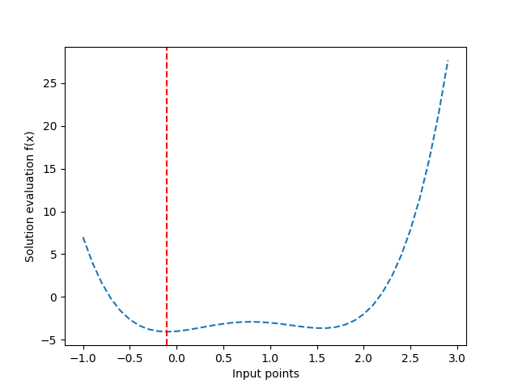

# Python implementations of Hill Climbing search algorithm

### Running the code
- create virtual environment with `pip` or `conda` and activate it,
- install dependencies from the `requirements.txt` file, for example `pip install -r requirements.txt`, 
- run the given script with `python name_of_the_file.py`,
- enjoy the results :smiley:

### I. A little bit of theory  
The **hill climbing algorithm** involves generating a candidate solution and evaluating it. 
This is the starting point that is then incrementally improved until either no further improvement can be achieved or we run out of time, 
resources, or interest.

New candidate solutions are generated from the existing candidate solution. 
Typically, this involves making a single change to the candidate solution, 
evaluating it, and accepting the candidate solution as the new “current” solution if it is as good or better than the previous current solution. 
Otherwise, it is discarded.

### II. Versions of the algorithm
- standard version (file `01-parabola-objective.py`) with parabola as a objective function:  
  

- standard version (file `02-fourth-rank-objective.py`) with 4th rank polynomial as a objective function:
  

- coming soon

### III. Bibliography
1. "Optimization for Machine Learning", J. Brownlee, 2023.
2. "Hill-Climb-Assembler Encoding: Evolution of Small/Mid-Scale Artificial Neural Networks for Classification and
Control Problems", T. Praczyk, 2022.
3. "Artificial Intelligence: A Modern Approach", S. Russell and P. Norvig, 2009.

