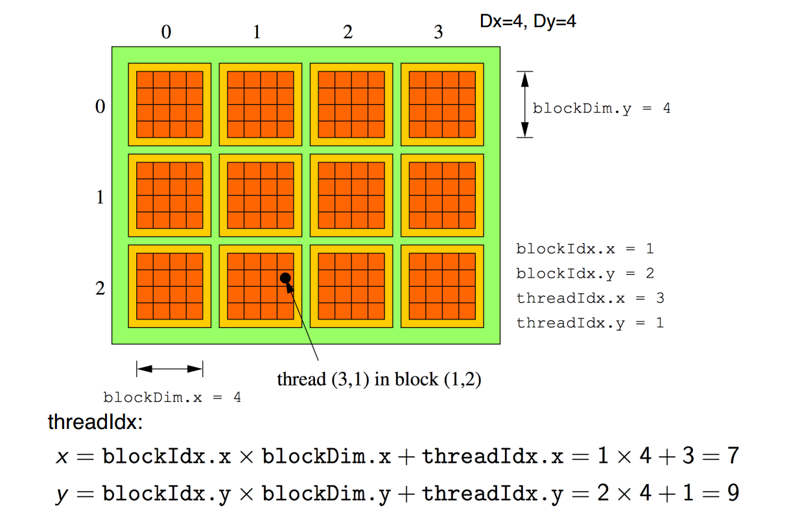

### NumPy and other stuff related to faster execution of Python programs

#### 1. Links
  - [NumPy](https://numpy.org/doc/stable/index.html) documentation,
  - [JAX](https://jax.readthedocs.io/en/latest/index.html): High-Performance Array Computing,
  - [XLA](https://openxla.org/xla) (Accelerated Linear Algebra) is an open-source compiler for machine learning,
  - [Flax](https://flax.readthedocs.io/en/latest/): Neural networks with JAX,
  - [Optax](https://optax.readthedocs.io/en/latest/): gradient processing and optimization library for JAX,
  - [Orbax](https://orbax.readthedocs.io/en/latest/): training utilities for JAX users,
  - Intro to [Machine Learning](https://python-course.eu/machine-learning/) with NumPy.

#### 2. CUDA parameters and basic terminology
- Cores, Schedulers and Streaming Multiprocessors  
CUDA GPUs have many parallel processors grouped into **Streaming Multiprocessors**, or SMs.   
Each SM can run multiple concurrent thread blocks. As an example, a Tesla P100 GPU based on the Pascal GPU Architecture has 56 SMs, each capable of supporting up to 2048 active threads.

GPUs are designed to apply the same function to many data simultaneously.
>A **stream** in CUDA is a sequence of operations that execute on the device in the order in which they are issued by the host code. While operations within a stream are guaranteed to execute in the prescribed order, operations in different streams can be interleaved and, when possible, they can even run concurrently.

- CUDA indexing (in 1-D)

> **threadIdx** 	the ID of a thread in a block  
**blockDim** 	the size of a block, i.e. the number of threads per dimension  
**blockIdx** 	the ID of a block in the grid  
**gridDim** 	the size of the grid, i.e. the number of blocks per dimension  
 
- Dimensions of the block/grid

> The gridDim and blockDim are 3D variables. However, if the y or z dimension is not specified explicitly then the defualt value 1 is prescribed for y or z.

- Some CUDA keywords  
`__global__` 	the function is visible to the host and the GPU, and runs on the GPU,  
`__host__` 	the function is visible only to the host, and runs on the host,  
`__device__` 	the function is visible only to the GPU, and runs on the GPU.
#### 3. Benchmarks
  - Python's list vs Numpy's array (file `1_numpy_array_vs_python_list.py`):    
```bash
Standard list with range() - created in 2.565 seconds.
Numpy's array - created in 0.125 seconds.
Sum of list (Python) - calculated in 60.86 seconds.
Sum of array (Numpy) - calculated in 1.43 seconds.
```

  - Numba vs Numpy (file `3_numba_vs_numpy.py`):  
```bash
Elapsed time (only Python): 0.003462 seconds.
Elapsed time (only Numpy): 0.004415 seconds.
Elapsed time (with Numba compilation): 0.548266 seconds.
Elapsed time (after Numba compilation): 0.001286 seconds.

```