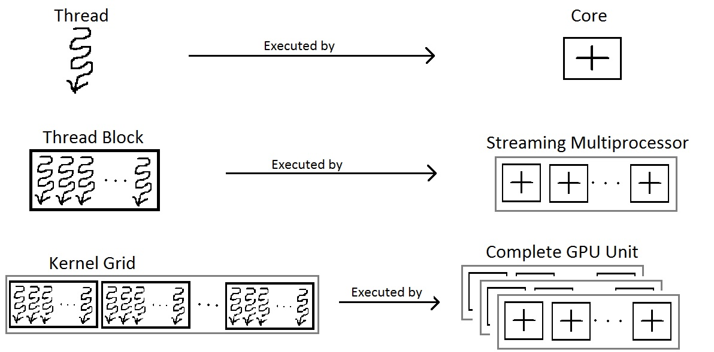

### NumPy and other stuff related to faster execution of Python programs

#### 1. Links
  - [NumPy](https://numpy.org/doc/stable/index.html) documentation,
  - [JAX](https://jax.readthedocs.io/en/latest/index.html): High-Performance Array Computing,
  - [XLA](https://openxla.org/xla) (Accelerated Linear Algebra) is an open-source compiler for machine learning,
  - [Flax](https://flax.readthedocs.io/en/latest/): Neural networks with JAX,
  - [Optax](https://optax.readthedocs.io/en/latest/): gradient processing and optimization library for JAX,
  - [Orbax](https://orbax.readthedocs.io/en/latest/): training utilities for JAX users,
  - Intro to [Machine Learning](https://python-course.eu/machine-learning/) with NumPy.

#### 2. CUDA parameters and basic terminology
- Cores, Schedulers and Streaming Multiprocessors  
CUDA GPUs have many parallel processors grouped into **Streaming Multiprocessors**, or SMs.   
Each SM can run multiple concurrent thread blocks. As an example, a Tesla P100 GPU based on the Pascal GPU Architecture has 56 SMs, each capable of supporting up to 2048 active threads.

GPUs are designed to apply the same function to many data simultaneously.
>A **stream** in CUDA is a sequence of operations that execute on the device in the order in which they are issued by the host code. While operations within a stream are guaranteed to execute in the prescribed order, operations in different streams can be interleaved and, when possible, they can even run concurrently.

- CUDA indexing (in 1-D)

> **threadIdx** 	the ID of a thread in a block  
**blockDim** 	the size of a block, i.e. the number of threads per dimension  
**blockIdx** 	the ID of a block in the grid  
**gridDim** 	the size of the grid, i.e. the number of blocks per dimension  
 
- Dimensions of the block/grid

> The gridDim and blockDim are 3D variables. However, if the y or z dimension is not specified explicitly then the defualt value 1 is prescribed for y or z.

- Some CUDA keywords  
`__global__` 	the function is visible to the host and the GPU, and runs on the GPU,  
`__host__` 	the function is visible only to the host, and runs on the host,  
`__device__` 	the function is visible only to the GPU, and runs on the GPU.

#### 3. The GPU is a lot slower than the CPU. What happened??

It could be one of the reasons:
  - Our inputs are too small: the GPU achieves performance through parallelism, operating on thousands of values at once. 
    Our test inputs have only 4 and 16 integers, respectively. 
    We need a much larger array to even keep the GPU busy.
  - Our calculation is too simple: Sending a calculation to the GPU involves quite a bit of overhead compared to calling a function on the CPU. 
    If our calculation does not involve enough math operations (often called "arithmetic intensity"), then the GPU will spend most of its time waiting for data to move around.
  - We copy the data to and from the GPU: While including the copy time can be realistic for a single function, often we want to run several GPU operations in sequence. 
    In those cases, it makes sense to send data to the GPU and keep it there until all of our processing is complete.
  - Our data types are larger than necessary: Our example uses int64 when we probably don’t need it. 
    Scalar code using data types that are 32 and 64-bit run basically the same speed on the CPU, but 64-bit data types have a significant performance cost on the GPU. 
    Basic arithmetic on 64-bit floats can be anywhere from 2x (Pascal-architecture Tesla) to 24x (Maxwell-architecture GeForce) slower than 32-bit floats. 
    NumPy defaults to 64-bit data types when creating arrays, so it is important to set the dtype attribute or use the `ndarray.astype()` method to pick 32-bit types when you need them.


#### 4. Benchmarks
  - Python's list vs Numpy's array (file `1_numpy_array_vs_python_list.py`):    
```bash
Standard list with range() - created in 2.554 seconds.
Numpy's array - created in 0.146 seconds.
Sum of list (Python) - calculated in 62.212 seconds.
Sum of array (Numpy) - calculated in 1.46 seconds.
```

  - Conversion CPU <-> GPU with CuPy and Numpy (file `2a_cupy_vs_numpy.py`):    
```bash
c_cpu=array([0.48116782, 1.1899436 , 0.32619858, ..., 0.42588684, 0.564336  ,
       0.8028442 ], dtype=float32)
cp.asnumpy(c_gpu)=array([0.48116782, 1.1899436 , 0.32619858, ..., 0.42588684, 0.564336  ,
       0.8028442 ], dtype=float32)
c_gpu.device=<CUDA Device 0>
Error = 0.0
```

  - Wrong size of vectors for GPU (file `2b_cupy_vs_numpy_wrong_size.py`):    
```bash
Traceback (most recent call last):
  File "/home/artur/Desktop/PROJECTS/Python-optimization-algorithms-with-GPU/numpy_utils/2b_cupy_vs_numpy_wrong_size.py", line 28, in <module>
    vector_add_gpu((1, 1, 1), (size, 1, 1), (a_gpu, b_gpu, c_gpu, size))
  File "cupy/_core/raw.pyx", line 93, in cupy._core.raw.RawKernel.__call__
  File "cupy/cuda/function.pyx", line 223, in cupy.cuda.function.Function.__call__
  File "cupy/cuda/function.pyx", line 205, in cupy.cuda.function._launch
  File "cupy_backends/cuda/api/driver.pyx", line 273, in cupy_backends.cuda.api.driver.launchKernel
  File "cupy_backends/cuda/api/driver.pyx", line 63, in cupy_backends.cuda.api.driver.check_status
cupy_backends.cuda.api.driver.CUDADriverError: CUDA_ERROR_INVALID_VALUE: invalid argument
```

  - Using proper CUDA indexing in the kernel (file ` 2c_cupy_vs_numpy_with_grid.py`):    
```bash
c_cpu=array([0.48116782, 1.1899436 , 0.32619858, ..., 0.42588684, 0.564336  ,
       0.8028442 ], dtype=float32)
cp.asnumpy(c_gpu)=array([0.48116782, 1.1899436 , 0.32619858, ..., 0.42588684, 0.564336  ,
       0.8028442 ], dtype=float32)
c_gpu.device=<CUDA Device 0>
Error = 0.0
```

```python
# CUDA version of vector_add
kernel_add_cuda = r'''
extern "C"
__global__ void vector_add(const float * A, const float * B, float * C, const int size)
{
    int item = threadIdx.x;
    C[item] = A[item] + B[item];
}
'''
```

  - Prime numbers Python vs CuPy (on GPU) (file `2d_cupy_prime_numbers.py`):    
```bash
Prime numbers time on CPU: 13.056 seconds.
Prime numbers time on GPU: 0.020410 seconds
```

  - Numba vs Numpy (file `3a_numba_vs_numpy.py`):  
```bash
Elapsed time (only Python): 0.224118 seconds.
Elapsed time (only Numpy): 1.644501 seconds.
Elapsed time (with Numba compilation): 0.534129 seconds.
Elapsed time (after Numba compilation): 0.004018 seconds.
```